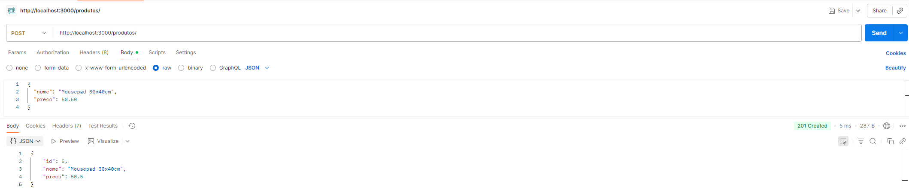
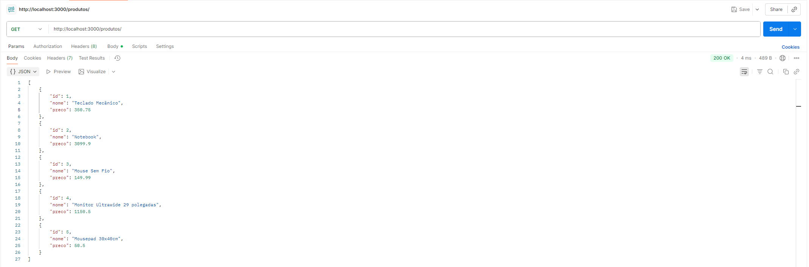
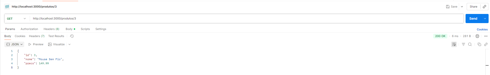
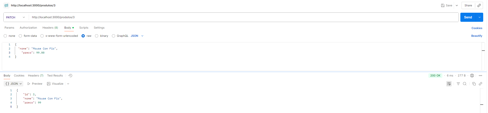
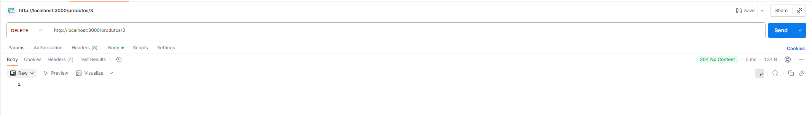

# 🛒 Atividade Avaliativa 01: API de Produtos (CRUD em memória)

Este projeto implementa uma API REST simples para o gerenciamento de produtos (operações CRUD). A aplicação foi desenvolvida em Node.js com Express.js, e os dados são armazenados temporariamente em memória.

## 🚀 Como Rodar o Projeto

### Pré-requisitos
* Node.js 
* npm 

### Passos para Execução

1.  **Clone o repositório** (ou baixe os arquivos):
    ```bash
    git clone https://github.com/Sergio-now/Atividade1_PI2.git
    cd Atividade1_PI2-main
    ```

2.  **Instale as dependências**:
    ```bash
    npm install
    ```

3.  **Inicie o servidor**:
    ```bash
    npm start
    ```

O servidor estará disponível no endereço: `http://localhost:3000`

## 📁 Estrutura do Projeto

```
├── main.js                 # Servidor principal
├── routes/
│   └── products.routes.js   # Rotas dos produtos
├── package.json            # Dependências
└── README.md               # Documentação
```

## 📚 Endpoints da API (Rotas)

A seguir estão detalhadas todas as rotas implementadas na API.

### 1. Criar Produto
* `POST /produtos`
* **Descrição**: Adiciona um novo produto à lista. O ID é gerado automaticamente de forma incremental.
* **Body (JSON)**:
    ```json
    {
      "nome": "string",
      "preco": numero
    }
    ```
* **Status Codes**:
    * `201 Created`: Produto criado com sucesso. Retorna o objeto do produto criado.
    * `400 Bad Request`: Se os campos `nome` (string) ou `preco` (número >= 0) estiverem ausentes ou inválidos.

### 2. Listar Todos os Produtos
* `GET /produtos`
* **Descrição**: Retorna um array com todos os produtos cadastrados.
* **Status Codes**:
    * `200 OK`: Retorna a lista de produtos (pode ser um array vazio).

### 3. Buscar Produto por ID
* `GET /produtos/:id`
* **Descrição**: Retorna um único produto com base no `id` fornecido na URL.
* **Status Codes**:
    * `200 OK`: Produto encontrado. Retorna o objeto do produto.
    * `400 Bad Request`: Se o `id` não for um número.
    * `404 Not Found`: Se nenhum produto com o `id` informado for encontrado.

### 4. Atualizar Produto (Completo)
* `PUT /produtos/:id`
* **Descrição**: Atualiza **todos** os campos (`nome` e `preco`) de um produto existente.
* **Body (JSON)**:
    ```json
    {
      "nome": "string",
      "preco": numero
    }
    ```
* **Status Codes**:
    * `200 OK`: Produto atualizado com sucesso. Retorna o objeto do produto atualizado.
    * `400 Bad Request`: Se o `id` for inválido ou se os campos `nome` ou `preco` estiverem ausentes no body.
    * `404 Not Found`: Se o produto com o `id` informado não for encontrado.

### 5. Atualizar Produto (Parcial)
* `PATCH /produtos/:id`
* **Descrição**: Atualiza **parcialmente** um produto (apenas `nome` ou apenas `preco`, ou ambos).
* **Body (JSON)** (campos opcionais):
    ```json
    {
      "nome": "string (opcional)",
      "preco": numero (opcional)
    }
    ```
* **Status Codes**:
    * `200 OK`: Produto atualizado com sucesso. Retorna o objeto do produto atualizado.
    * `400 Bad Request`: Se o `id` for inválido, se o `preco` for inválido (ex: negativo) ou se nenhum campo for enviado.
    * `404 Not Found`: Se o produto com o `id` informado não for encontrado.

### 6. Deletar Produto
* `DELETE /produtos/:id`
* **Descrição**: Remove um produto da lista com base no `id` fornecido.
* **Status Codes**:
    * `204 No Content`: Produto removido com sucesso. (Não retorna corpo na resposta).
    * `400 Bad Request`: Se o `id` não for um número.
    * `404 Not Found`: Se o produto com o `id` informado não for encontrado.

---

## 📊 Tabela de Status Codes Utilizados

Resumo dos códigos HTTP implementados e seus significados na API:

| Código | Descrição | Onde é usado |
| :--- | :--- | :--- |
| `200 OK` | Requisição bem-sucedida. | `GET` (todos), `GET` (por id), `PUT`, `PATCH` |
| `201 Created` | Recurso criado com sucesso. | `POST /produtos` |
| `204 No Content` | Requisição bem-sucedida, sem corpo. | `DELETE /produtos/:id` |
| `400 Bad Request` | Requisição inválida (body ou ID). | Em todas as rotas que recebem `id` ou `body` (POST, PUT, PATCH, GET por id, DELETE) |
| `404 Not Found` | Recurso não encontrado. | Em todas as rotas que usam `id` (GET por id, PUT, PATCH, DELETE) |

---


## 🧪 Testes no Postman

Abaixo estão os *prints* dos testes realizados no Postman para validar cada funcionalidade da API.

### 1. `POST /produtos` (Criando produtos)


### 2. `GET /produtos` (Listando todos)


### 3. `GET /produtos/:id` (Buscar com sucesso)


### 4. `GET /produtos/:id` (Erro 404 - Não encontrado)
**Lembrar de adicionar print do teste 404 aqui e renomear o arquivo para `get_404.png`**


### 5. `PUT /produtos/:id` (Atualização completa)


### 6. `PATCH /produtos/:id` (Atualização parcial)


### 7. `DELETE /produtos/:id` (Deletar com sucesso)


### 8. `DELETE /produtos/:id` (Erro 404 - Não encontrado)
**Lembrar de adicionar print do teste 404 aqui e renomear o arquivo para `delete_404.png`**

